# Plataforma Web para la Simulación de Compra, Venta e Intercambio de Criptomonedas

# Fernando Camargo
# Carnet-0908-19-2575

## 1. Introducción

El crecimiento de las criptomonedas ha transformado significativamente la manera en que las personas realizan inversiones y transacciones financieras a nivel mundial. Activos digitales como Bitcoin, Ethereum y Tether han adquirido gran relevancia dentro de los mercados financieros debido a su descentralización, accesibilidad y potencial de crecimiento.

Sin embargo, la participación en estos mercados implica riesgos asociados a la volatilidad de los precios y a la falta de conocimiento por parte de usuarios principiantes. Por esta razón, surge la necesidad de desarrollar herramientas que permitan comprender el comportamiento de estos activos sin exponer recursos económicos reales.

El presente proyecto consiste en el desarrollo de una plataforma web para la simulación de compra, venta e intercambio de criptomonedas. El sistema permitirá a los usuarios registrarse, administrar un portafolio virtual de activos digitales, consultar precios actuales e históricos mediante una API especializada y ejecutar simulaciones financieras que serán almacenadas para su posterior consulta.

La solución será desarrollada utilizando **Laravel** como framework backend, **Vue 3 con Inertia.js** para la capa de presentación y **MySQL** como sistema gestor de bases de datos. Asimismo, se aplicará un enfoque **Domain Driven Design (DDD) Lite pragmático**, apoyado en *Services*, *Repositories* y *DTOs*, que favorezca la separación de responsabilidades, la mantenibilidad y la escalabilidad sin introducir sobrecarga estructural innecesaria.

---

## 2. Planteamiento del Problema

Actualmente existe un creciente interés por parte de personas que desean conocer el funcionamiento del mercado de criptomonedas antes de invertir dinero real. Sin embargo, muchas plataformas existentes están orientadas a usuarios con experiencia financiera o requieren realizar operaciones reales que pueden representar pérdidas económicas para quienes aún se encuentran en proceso de aprendizaje.

La ausencia de una herramienta académica que permita realizar simulaciones de compra, venta e intercambio de criptomonedas utilizando información actualizada del mercado limita las oportunidades de aprendizaje práctico de los usuarios.

Por lo anterior, se plantea el desarrollo de una plataforma web que permita simular operaciones con criptomonedas utilizando datos reales obtenidos desde servicios especializados, proporcionando un entorno seguro para el análisis y comprensión del comportamiento del mercado sin riesgos financieros reales.

---

## 3. Justificación

El desarrollo de una plataforma de simulación de criptomonedas permitirá a estudiantes, inversionistas principiantes y usuarios interesados comprender el funcionamiento de los mercados digitales mediante experiencias prácticas controladas.

La implementación de este sistema facilitará el aprendizaje de conceptos relacionados con activos digitales, fluctuaciones de precios, estrategias de compra y venta e intercambio de criptomonedas, utilizando información obtenida en tiempo real desde servicios especializados.

Además, el proyecto servirá como aplicación práctica de tecnologías modernas de desarrollo web, incluyendo Laravel, Vue.js, APIs REST, bases de datos relacionales y principios de arquitectura de software orientados al dominio, fortaleciendo las competencias técnicas adquiridas durante la formación académica.

---

## 4. Objetivo General

Desarrollar una plataforma web para la simulación de compra, venta e intercambio de criptomonedas que permita a los usuarios realizar operaciones virtuales utilizando información actualizada del mercado mediante servicios API especializados.

## 5. Objetivos Específicos

1. Diseñar e implementar un sistema de registro y autenticación de usuarios.
2. Integrar una API de criptomonedas que permita consultar precios actuales e históricos.
3. Implementar funcionalidades para la simulación de compra de criptomonedas.
4. Implementar funcionalidades para la simulación de venta de criptomonedas mostrando resultados en dólares estadounidenses y moneda local.
5. Implementar funcionalidades para la simulación de intercambio entre diferentes criptomonedas.
6. Almacenar en la base de datos todas las simulaciones aceptadas por los usuarios.
7. Implementar reportes históricos y filtros de búsqueda para las simulaciones realizadas.
8. Aplicar una arquitectura basada en DDD Lite pragmático (Services, Repositories y DTOs) que facilite la mantenibilidad y escalabilidad del sistema.

---

## 6. Alcance del Proyecto

El sistema permitirá administrar usuarios, consultar información actualizada de criptomonedas y realizar simulaciones virtuales de compra, venta e intercambio utilizando datos reales obtenidos desde una API externa.

Las simulaciones afectarán únicamente los saldos virtuales administrados por la plataforma y **no ejecutarán transacciones reales** en mercados financieros.

El proyecto contempla la gestión de al menos tres criptomonedas principales:

- Bitcoin (BTC)
- Ethereum (ETH)
- Tether (USDT)

El modelo de datos es extensible: mediante el campo `is_active` de la tabla `cryptocurrencies` y el manejo dinámico de saldos con `portfolio_assets`, es posible incorporar nuevas criptomonedas (por ejemplo, Solana — SOL) sin modificar la estructura de la base de datos, en línea con el requerimiento de escalabilidad (RNF-004).

Además, se incluirán funcionalidades de auditoría, historial de operaciones, reportes y administración de portafolios virtuales.

### Incluye

- Registro de usuarios
- Inicio de sesión
- Gestión de portafolio virtual
- Consulta de precios actuales
- Consulta de precios históricos
- Simulación de compra
- Simulación de venta
- Simulación de intercambio
- Historial de simulaciones
- Auditoría de actividades
- Reportes

### No Incluye

- Compra real de criptomonedas
- Integración con billeteras reales
- Transferencias bancarias
- Trading automatizado
- Operaciones financieras reales

---

## 7. Actores del Sistema

### Usuario
Persona que accede a la plataforma para realizar simulaciones.

**Responsabilidades:**
- Registrarse.
- Iniciar sesión.
- Consultar precios.
- Realizar simulaciones.
- Consultar historial.

### API de Criptomonedas
Servicio externo encargado de proporcionar información actualizada del mercado.

**Responsabilidades:**
- Precios actuales.
- Valores históricos.
- Conversión entre criptomonedas.

### Base de Datos
Sistema encargado de almacenar:
- Usuarios.
- Portafolios.
- Simulaciones.
- Historial.
- Auditorías.

---

## 8. Requerimientos Funcionales

| ID | Nombre | Descripción |
|------|--------|-------------|
| RF-001 | Registro de Usuarios | El sistema deberá permitir registrar usuarios mediante correo electrónico y contraseña. |
| RF-002 | Autenticación | El sistema deberá permitir el acceso mediante credenciales válidas. |
| RF-003 | Consulta de Precios | El sistema deberá consultar los precios actuales de Bitcoin (BTC), Ethereum (ETH) y Tether (USDT). |
| RF-004 | Consulta Histórica | El sistema deberá permitir consultar valores históricos de criptomonedas. |
| RF-005 | Simulación de Compra | El usuario podrá simular la compra de criptomonedas utilizando saldo virtual. |
| RF-006 | Simulación de Venta | El usuario podrá simular la venta de criptomonedas obteniendo resultados en USD y GTQ. |
| RF-007 | Simulación de Intercambio | El usuario podrá intercambiar virtualmente una criptomoneda por otra. |
| RF-008 | Almacenamiento de Simulaciones | El sistema deberá almacenar únicamente las simulaciones aceptadas por el usuario. |
| RF-009 | Historial | El usuario podrá consultar el historial de simulaciones realizadas. |
| RF-010 | Auditoría | El sistema deberá registrar eventos importantes realizados por los usuarios. |

---

## 9. Requerimientos No Funcionales

| ID | Nombre | Descripción |
|------|--------|-------------|
| RNF-001 | Seguridad | Las contraseñas deberán almacenarse utilizando algoritmos de cifrado seguros. |
| RNF-002 | Disponibilidad | La plataforma deberá estar disponible desde navegadores modernos. |
| RNF-003 | Rendimiento | Las consultas de precios deberán responder en menos de tres segundos. |
| RNF-004 | Escalabilidad | La arquitectura deberá permitir agregar nuevas criptomonedas sin afectar el funcionamiento actual. |
| RNF-005 | Mantenibilidad | La solución deberá implementarse aplicando un enfoque DDD Lite pragmático (Services, Repositories y DTOs) que mantenga separadas las responsabilidades. |

---

## 10. Reglas de Negocio

| ID | Regla |
|------|-------|
| RN-01 | Un usuario debe estar autenticado para realizar simulaciones. |
| RN-02 | Una simulación solamente afectará el portafolio cuando el usuario decida guardarla. |
| RN-03 | No se podrá vender una cantidad superior a la disponible en el portafolio. |
| RN-04 | No se podrá intercambiar una cantidad superior al saldo disponible. |
| RN-05 | Toda simulación almacenada deberá registrar: Fecha, Hora, Tipo de operación, Criptomoneda involucrada y Precio utilizado. |
| RN-06 | Los precios utilizados deberán provenir de la API seleccionada. |

---

## 11. Casos de Uso Principales

| ID | Caso de Uso | Actor | Descripción |
|------|-------------|-------|-------------|
| CU-01 | Registrar Usuario | Usuario | Permite crear una nueva cuenta dentro del sistema. |
| CU-02 | Iniciar Sesión | Usuario | Permite acceder a la plataforma mediante credenciales válidas. |
| CU-03 | Consultar Precios | Usuario | Permite visualizar precios actuales e históricos. |
| CU-04 | Simular Compra | Usuario | Permite adquirir criptomonedas virtuales utilizando saldo disponible. |
| CU-05 | Simular Venta | Usuario | Permite vender criptomonedas virtuales. |
| CU-06 | Simular Intercambio | Usuario | Permite intercambiar criptomonedas entre sí. |
| CU-07 | Consultar Historial | Usuario | Permite consultar operaciones realizadas previamente. |

---

## 12. Riesgos Identificados

| Riesgo | Impacto |
|--------|---------|
| API externa fuera de servicio | Alto |
| Cambios en endpoints de API | Medio |
| Saturación de consultas | Medio |
| Errores de cálculo financiero | Alto |
| Pérdida de datos | Alto |

---

## 13. Tecnologías Seleccionadas

| Componente | Tecnología |
|------------|------------|
| Backend | Laravel 12 |
| Frontend | Vue 3 |
| Comunicación SPA | Inertia.js |
| Base de Datos | MySQL 8 |
| API Cripto | CoinGecko |
| Autenticación | Laravel Breeze |
| ORM | Eloquent |
| Arquitectura | DDD Lite pragmático (Services + Repositories + DTOs) |
| Control de versiones | Git |

---

## 14. Diseño de Arquitectura del Sistema

### 14.1 Arquitectura General

La solución se implementará aplicando un enfoque **DDD Lite pragmático**: se conservan los conceptos de valor de Domain Driven Design (lógica de negocio aislada en *Services*, acceso a datos a través de *Repositories* y transporte de datos mediante *DTOs*), pero **sin imponer una separación física rígida en múltiples capas para cada clase**. El objetivo es desacoplar la lógica de negocio de la infraestructura y mantener un código ordenado y mantenible, evitando la sobrecarga estructural que no aporta valor en un proyecto de este tamaño.

En la práctica, el flujo principal es: **Controller → Service → Repository → Eloquent/MySQL**, con *DTOs* para mover datos entre capas y un servicio dedicado para la integración con CoinGecko.

| Capa | Tecnología |
|------|------------|
| Frontend | Vue 3 |
| SPA Bridge | Inertia.js |
| Backend | Laravel 12 |
| Base de Datos | MySQL 8 |
| API Externa | CoinGecko |
| Cache | Laravel Cache · driver `database` (Redis opcional) |
| Autenticación | Laravel Breeze |

### 14.2 Organización en Capas Lógicas

La aplicación se organiza en capas **lógicas** (no en proyectos ni módulos físicos separados). El siguiente diagrama muestra el flujo de una petición y la responsabilidad de cada capa:

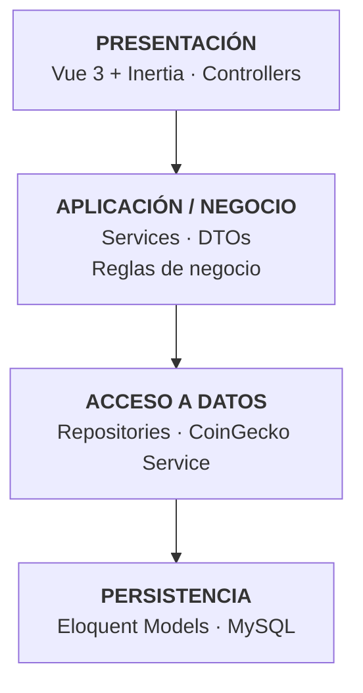

> **Nota pragmática:** las reglas de negocio viven en los *Services* y el acceso a datos en los *Repositories*. No se crean Entidades de dominio ni Value Objects separados de los modelos Eloquent salvo cuando aporten claridad; los modelos Eloquent cumplen el doble rol de entidad + persistencia. Esto reduce el código repetitivo manteniendo la separación de responsabilidades.

### 14.3 Justificación del DDD Lite Pragmático

Se utilizará una aproximación **ligera y pragmática** de Domain Driven Design debido a que:

- El dominio es relativamente pequeño.
- No existen múltiples contextos delimitados complejos.
- El proyecto es académico y con un alcance acotado.
- Permite demostrar separación de responsabilidades sin sobre-ingeniería.

**Sí se implementará (el núcleo que aporta valor):**
- **Services** que concentran la lógica de negocio (compra, venta, intercambio, precios).
- **Repositories** que aíslan el acceso a datos (intercambiables: MySQL hoy, otro motor mañana).
- **DTOs** para transportar datos entre la capa de presentación y los servicios.
- Separación lógica de responsabilidades (presentación / negocio / datos).

**No se implementará (sobrecarga innecesaria para este alcance):**
- Event Sourcing
- CQRS
- Domain Events complejos
- Aggregate Roots avanzados
- Entidades de dominio y Value Objects separados de los modelos Eloquent (salvo casos puntuales que lo justifiquen)
- Separación física estricta de las capas en cada clase

### 14.4 Organización de Módulos

El sistema se dividirá en los siguientes módulos funcionales:

**Módulo de Seguridad**
- Registro
- Login
- Logout
- Recuperación de contraseña

**Módulo de Usuarios**
- Gestión de perfil
- Consulta de información

**Módulo de Portafolio**
- Saldo base en USD (`usd_balance`)
- Saldos por criptomoneda gestionados dinámicamente mediante `PortfolioAsset` (BTC, ETH, USDT, SOL, …)
- Alta/baja de activos sin modificar el esquema de la tabla

**Módulo de Criptomonedas**
- Consultar precios
- Consultar históricos
- Conversión

**Módulo de Simulaciones**
- Compra
- Venta
- Intercambio

**Módulo de Reportes**
- Historial
- Filtros
- Exportaciones

**Módulo de Auditoría**
- Registro de eventos
- Trazabilidad

### 14.5 Arquitectura Física

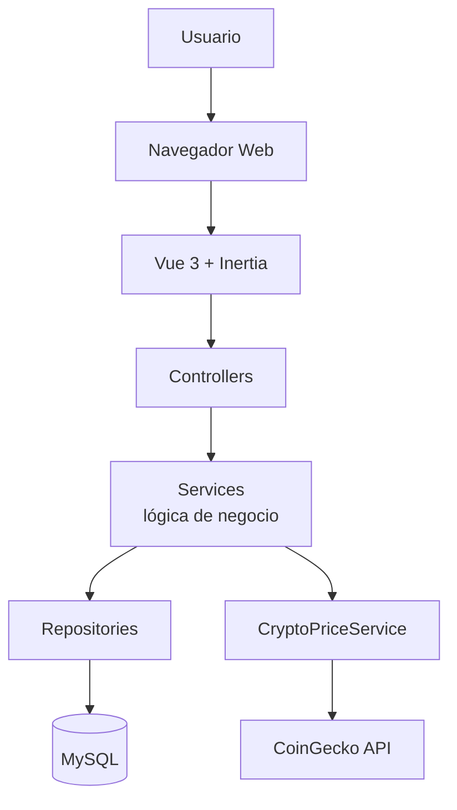

### 14.6 Integración con CoinGecko

**Flujo:**

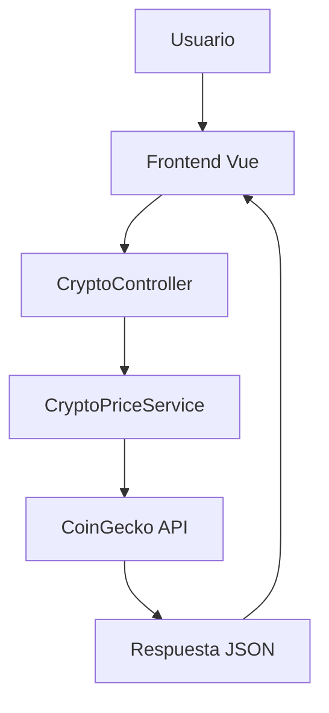

### 14.7 Estrategia de Cache

Para evitar excesivas llamadas a CoinGecko se emplea la capa de caché de Laravel (`Cache::remember`). Gracias a que Laravel abstrae el almacenamiento, el código del `CryptoPriceService` es independiente del driver: hoy se usa el driver **`database`** (las entradas se guardan en la tabla `cache` de MySQL) y puede conmutarse a **Redis** únicamente cambiando configuración en `.env` (`CACHE_STORE=redis`), sin modificar una sola línea de código.

`CryptoPriceService → Laravel Cache (database / Redis) → CoinGecko`

| Información | TTL (vigencia) |
|-------------|----------------|
| Precio actual | 5 minutos |
| Histórico | 24 horas |
| Exchange Rate USD/GTQ | 1 hora |

> **Estado actual:** driver `database` (tabla `cache` de MySQL). Redis queda contemplado como mejora opcional de rendimiento, lista para activarse en producción sin cambios de código.

### 14.8 Estructura de Carpetas Laravel

Estructura pragmática que mantiene las convenciones de Laravel y añade únicamente las carpetas que aportan valor (`Services`, `Repositories`, `DTOs`):

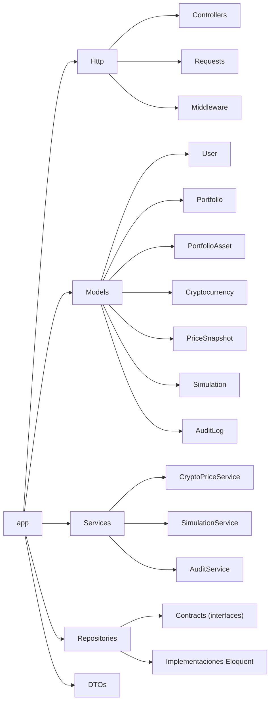

> Los **modelos Eloquent** actúan como entidades + persistencia. Los **Repositories** exponen interfaces (`Contracts`) con implementaciones Eloquent, lo que permite cambiar el motor de datos sin tocar los *Services*.

### 14.9 Estructura Frontend Vue 3

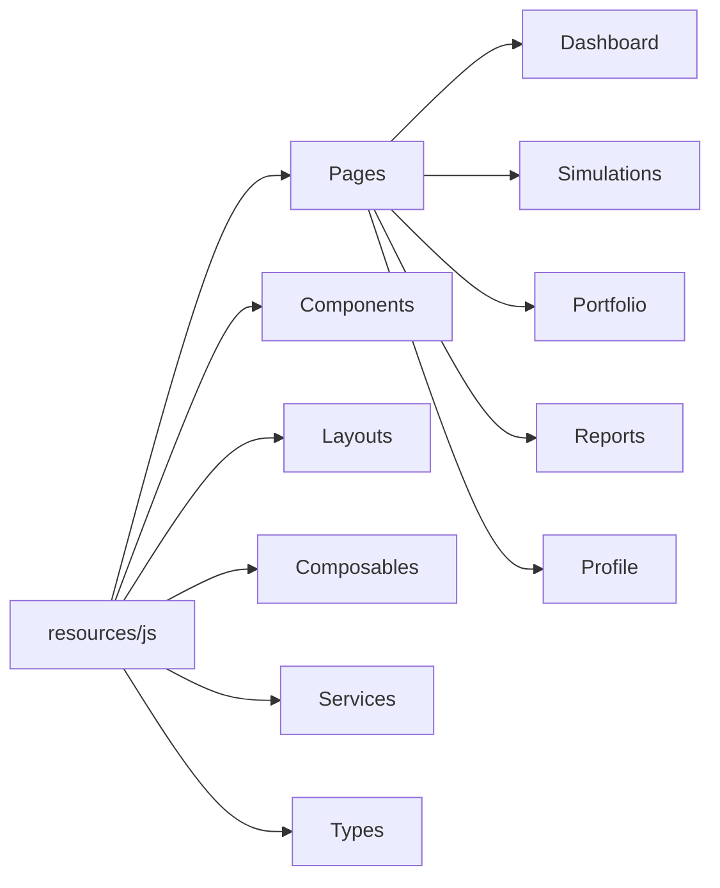

### 14.10 Diagrama de Componentes

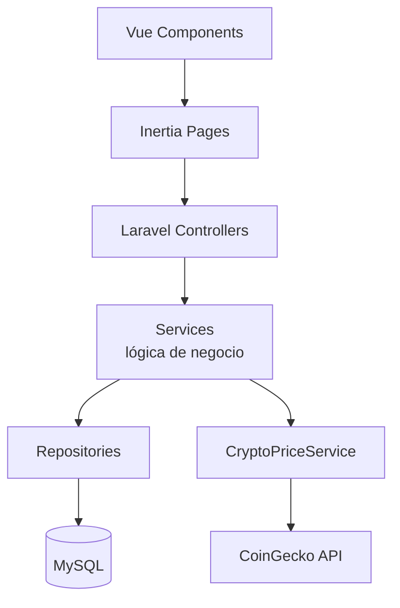

### 14.11 Decisiones Arquitectónicas

**¿Por qué Laravel + Inertia?**
- Menor complejidad que SPA pura.
- SEO amigable.
- Compartición de rutas y autenticación.
- Excelente integración con Laravel.

**¿Por qué CoinGecko?**
- API gratuita.
- Datos históricos.
- Documentación amplia.
- Alta disponibilidad.

**¿Por qué DDD Lite pragmático?**
- Concentra la lógica de negocio en *Services* fáciles de probar.
- Reduce el acoplamiento mediante *Repositories* con interfaces.
- Escalable para futuras criptomonedas.
- Evita la sobre-ingeniería (capas y abstracciones que no aportan valor en este alcance), acelerando el desarrollo.

**¿Por qué Repository Pattern?**

Permite cambiar la infraestructura sin modificar la lógica del dominio:

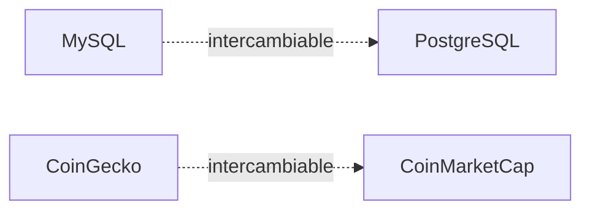

---

## 15. UML — Diagrama de Casos de Uso

### Actores

**Usuario** puede:
- Registrarse
- Iniciar sesión
- Gestionar perfil
- Consultar precios
- Consultar históricos
- Simular compra
- Simular venta
- Simular intercambio
- Consultar historial

**API CoinGecko** participa en:
- Obtener precio actual
- Obtener histórico
- Obtener conversiones

### Diagrama de Casos de Uso

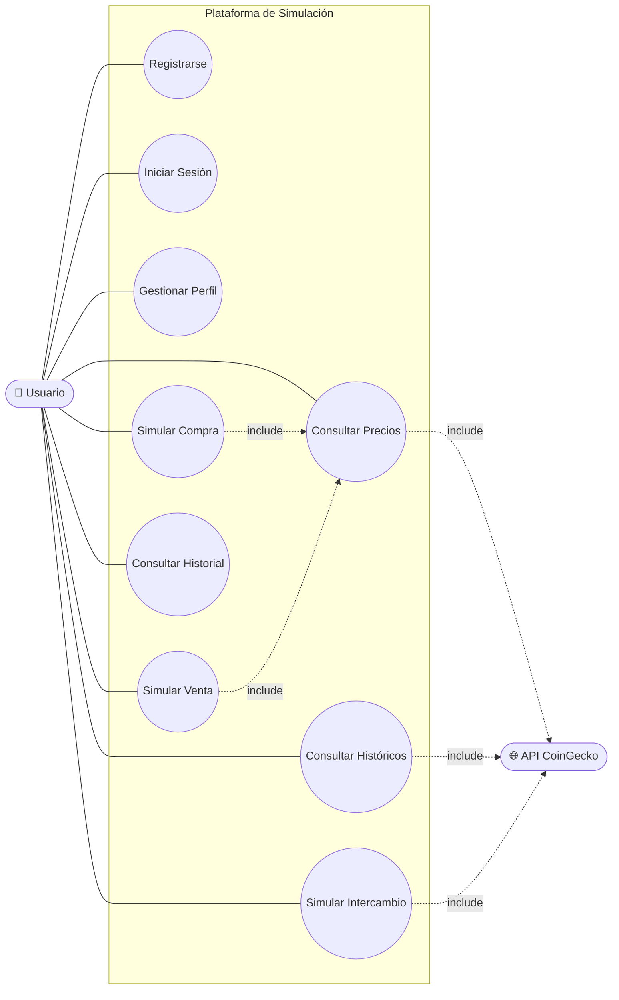

---

## 16. Especificación de Casos de Uso

### CU-01 Registrar Usuario

- **Actor:** Usuario
- **Descripción:** Permite registrar una nueva cuenta.

**Flujo Principal:**
1. Usuario accede al formulario.
2. Ingresa sus datos (nombre, correo, contraseña).
3. Declara su **estado inicial**: saldo en USD y, opcionalmente, las criptomonedas que ya posee con su cantidad.
4. Sistema valida la información.
5. Sistema crea el usuario.
6. Sistema crea el portafolio inicial con el saldo declarado y las tenencias de cripto indicadas (`portfolio_assets`).
7. Sistema confirma el registro e inicia sesión.

- **Precondiciones:** Ninguna.
- **Postcondiciones:** Usuario registrado con su portafolio en el estado inicial declarado.

> El estado inicial se verá afectado únicamente al **guardar** simulaciones (RN-02). Si el usuario no declara criptomonedas, su portafolio inicia solo con el saldo en USD.

### CU-02 Simular Compra

- **Actor:** Usuario
- **Descripción:** Permite comprar criptomonedas virtualmente.

**Flujo Principal:**
1. Usuario selecciona criptomoneda.
2. Ingresa monto USD.
3. Sistema consulta precio.
4. Sistema calcula cantidad.
5. Usuario visualiza resultado.
6. Usuario guarda simulación.

- **Precondición:** Usuario autenticado.
- **Postcondición:** Simulación almacenada.

### CU-03 Simular Venta

- **Actor:** Usuario
- **Descripción:** Permite vender criptomonedas.

**Flujo Principal:**
1. Selecciona criptomoneda.
2. Ingresa cantidad.
3. Sistema consulta precio.
4. Calcula USD.
5. Convierte USD → GTQ.
6. Usuario guarda.

### CU-04 Simular Intercambio

- **Actor:** Usuario
- **Descripción:** Permite intercambiar una criptomoneda por otra.

**Flujo Principal:**
1. Selecciona origen.
2. Selecciona destino.
3. Ingresa cantidad.
4. Sistema calcula equivalencia.
5. Usuario confirma.
6. Sistema almacena.

### CU-05 Consultar Historial

- **Actor:** Usuario

**Flujo:**
1. Usuario accede al módulo.
2. Selecciona filtros.
3. Sistema consulta base de datos.
4. Muestra resultados.

---

## 17. UML — Diagrama de Clases 

Este diagrama está alineado con DDD Lite. El portafolio mantiene un saldo base en USD y los saldos por criptomoneda se modelan de forma dinámica mediante `PortfolioAsset`, lo que permite agregar nuevas criptomonedas sin alterar la estructura.

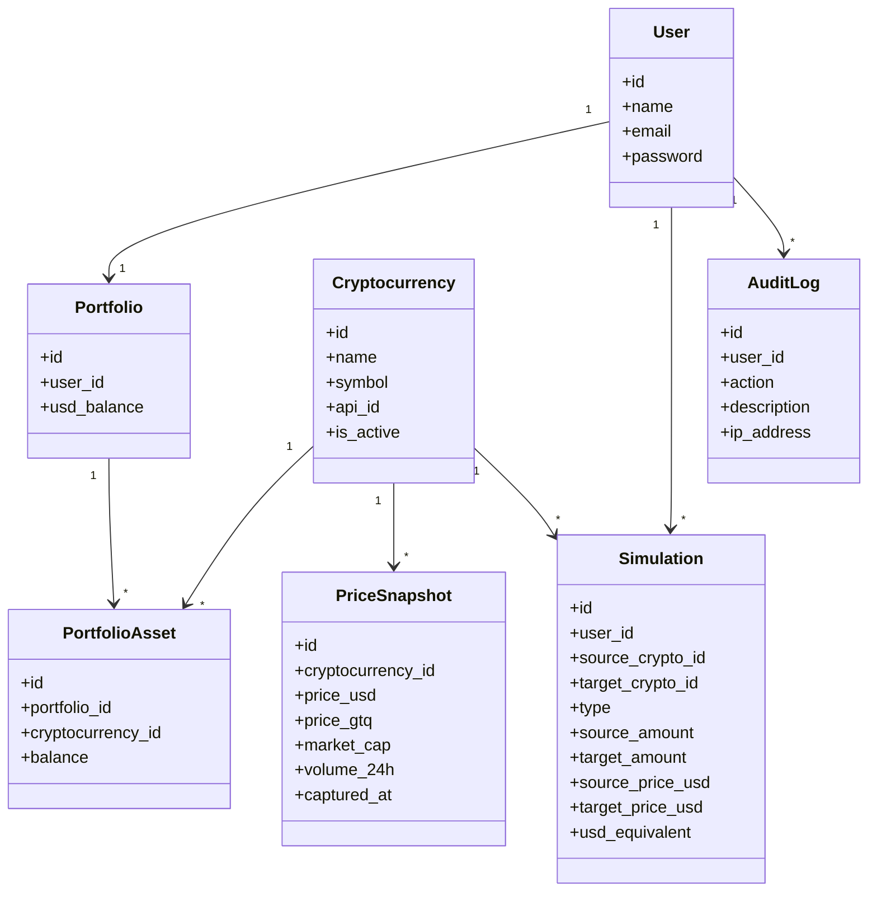

### Servicios de Negocio 

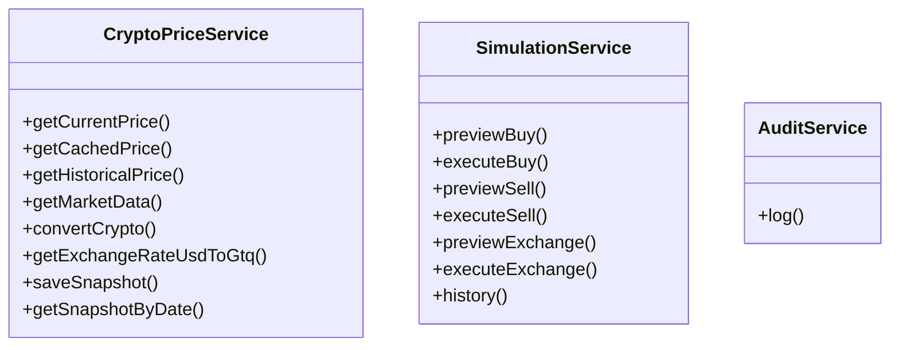

> **Notas de implementación:**
> - El guardado de precios (`PriceSnapshot`) es responsabilidad de `CryptoPriceService` mediante `saveSnapshot()`: al consultar el precio en CoinGecko se persiste el registro histórico en la misma operación, evitando una clase de servicio adicional.
> - `SimulationService` separa cada operación en **`preview…`** (calcula sin guardar, para cumplir RN-02) y **`execute…`** (persiste la simulación y actualiza el portafolio dentro de una transacción). La gestión de saldos del portafolio (descontar/sumar activos) vive dentro de estos métodos `execute…`, por lo que no se requirió una clase `PortfolioService` separada.
> - `AuditService.log()` centraliza el registro de eventos (RF-010); se invoca desde los controladores y desde los eventos de autenticación de Laravel (`Login`, `Registered`, `Logout`).

---

## 18. UML — Diagrama de Secuencia

### Simulación de Compra

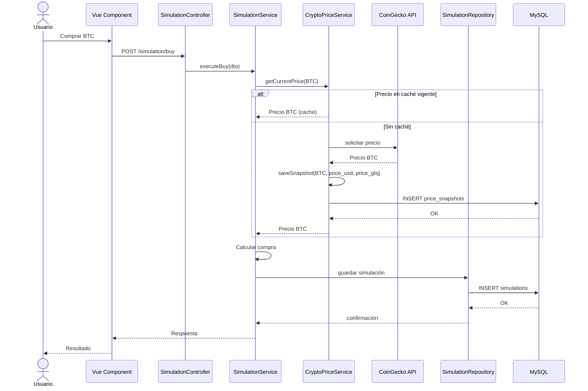

### Simulación de Venta

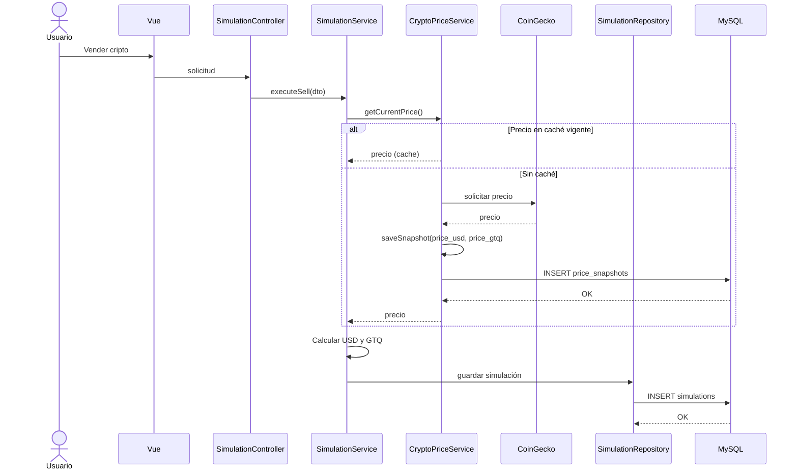

### Simulación de Intercambio

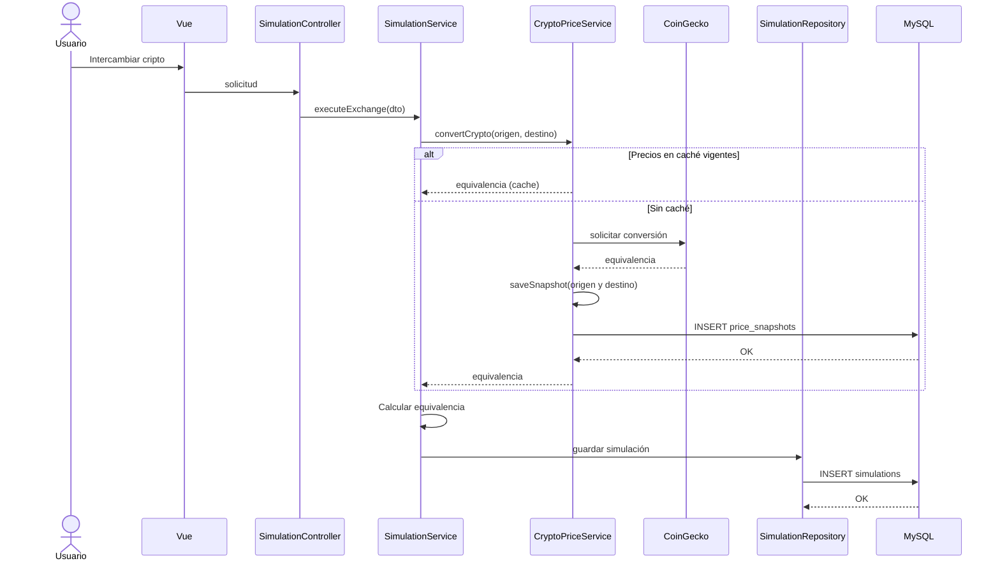

---

## 19. Modelo Entidad Relación (ERD) Final

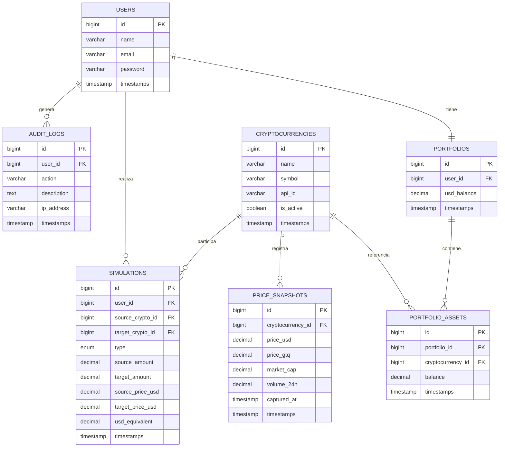

### Relaciones Definitivas (Laravel / Eloquent)

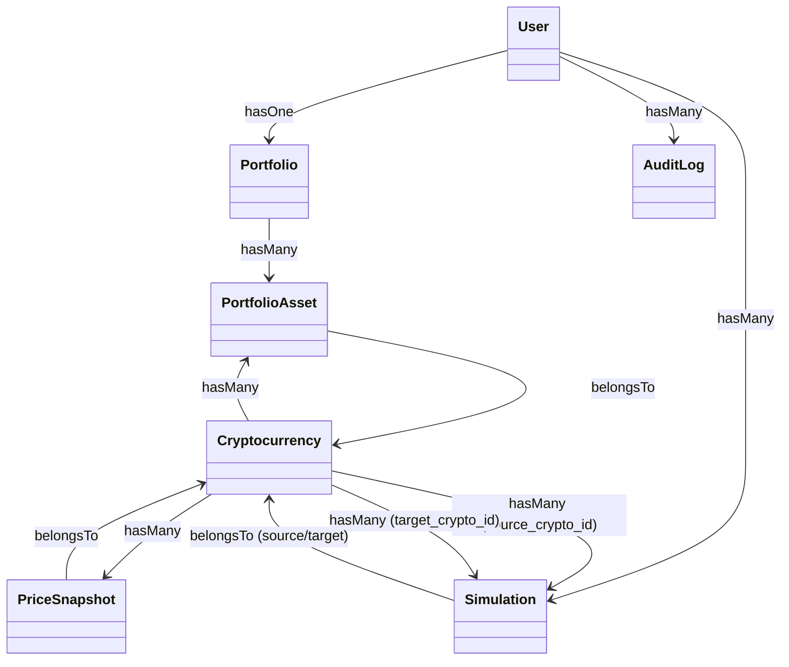

| Modelo | Relaciones |
|--------|-----------|
| **User** | `hasOne(Portfolio::class)` · `hasMany(Simulation::class)` · `hasMany(AuditLog::class)` |
| **Portfolio** | `belongsTo(User::class)` · `hasMany(PortfolioAsset::class)` |
| **PortfolioAsset** | `belongsTo(Portfolio::class)` · `belongsTo(Cryptocurrency::class)` |
| **Cryptocurrency** | `hasMany(PortfolioAsset::class)` · `hasMany(PriceSnapshot::class)` · `hasMany(Simulation::class, 'source_crypto_id')` · `hasMany(Simulation::class, 'target_crypto_id')` |
| **PriceSnapshot** | `belongsTo(Cryptocurrency::class)` |
| **Simulation** | `belongsTo(User::class)` · `belongsTo(Cryptocurrency::class, 'source_crypto_id')` · `belongsTo(Cryptocurrency::class, 'target_crypto_id')` |

---

## 20. Diccionario de Datos 

### Tabla `users`

| Campo | Tipo |
|-------|------|
| id | bigint |
| name | varchar(255) |
| email | varchar(255) |
| password | varchar(255) |

### Tabla `portfolios`

| Campo | Tipo |
|-------|------|
| id | bigint |
| user_id | bigint |
| usd_balance | decimal(24,8) |

### Tabla `cryptocurrencies`

| Campo | Tipo |
|-------|------|
| id | bigint |
| name | varchar(100) |
| symbol | varchar(20) |
| api_id | varchar(100) |
| is_active | boolean |

**Ejemplos:**

| name | symbol | api_id |
|------|--------|--------|
| Bitcoin | BTC | bitcoin |
| Ethereum | ETH | ethereum |
| Tether | USDT | tether |
| Solana | SOL | solana |

### Tabla `portfolio_assets`

| Campo | Tipo |
|-------|------|
| id | bigint |
| portfolio_id | bigint |
| cryptocurrency_id | bigint |
| balance | decimal(24,8) |

### Tabla `price_snapshots`

| Campo | Tipo |
|-------|------|
| id | bigint |
| cryptocurrency_id | bigint |
| price_usd | decimal(24,8) |
| price_gtq | decimal(24,8) |
| market_cap | decimal(24,2) |
| volume_24h | decimal(24,2) |
| captured_at | timestamp |

**Ejemplo:**

| cryptocurrency_id | price_usd | captured_at |
|-------------------|-----------|-------------|
| BTC | 109523.44 | 2026-06-10 15:00:00 |
| ETH | 5275.10 | 2026-06-10 15:00:00 |

### Tabla `simulations`

| Campo | Tipo |
|-------|------|
| id | bigint |
| user_id | bigint |
| source_crypto_id | bigint nullable |
| target_crypto_id | bigint nullable |
| type | enum |
| source_amount | decimal(24,8) |
| target_amount | decimal(24,8) |
| source_price_usd | decimal(24,8) |
| target_price_usd | decimal(24,8) |
| usd_equivalent | decimal(24,8) |

**Valores permitidos para `type`:** `BUY`, `SELL`, `EXCHANGE`

### Tabla `audit_logs`

| Campo | Tipo |
|-------|------|
| id | bigint |
| user_id | bigint |
| action | varchar(100) |
| description | text |
| ip_address | varchar(50) |

**Valores sugeridos para `action`:**
- `REGISTER`, `LOGIN`, `LOGOUT`, `UPDATE_PROFILE`
- `SIMULATE_BUY`, `SIMULATE_SELL`, `SIMULATE_EXCHANGE`
- `VIEW_PRICE`, `VIEW_HISTORY`
